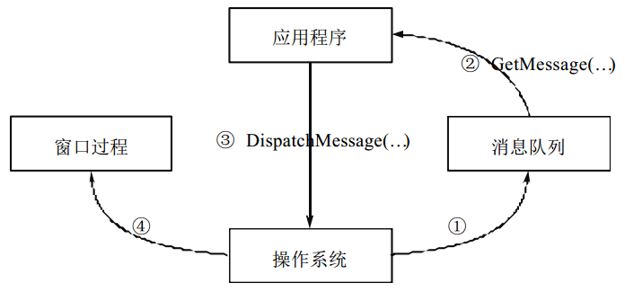
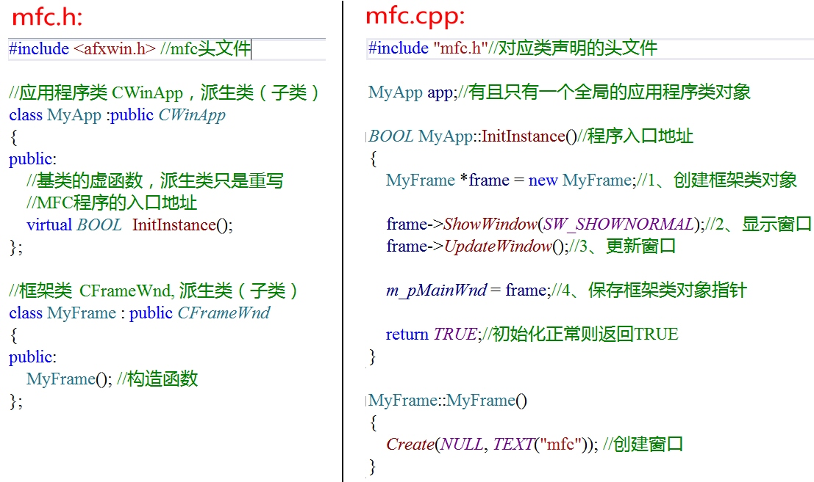
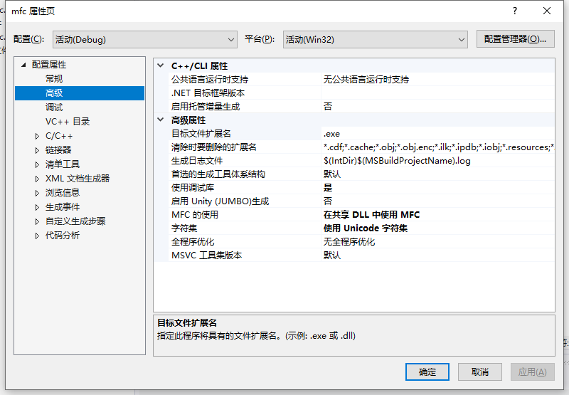
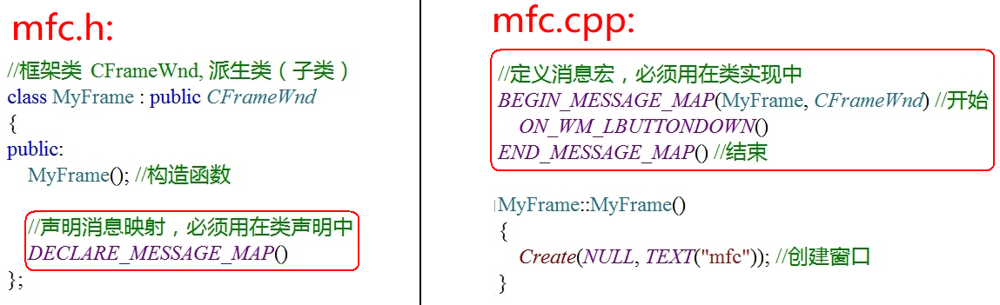
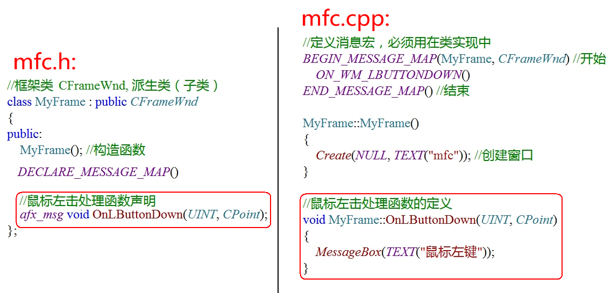

# Windows应用程序的一些概念

- 窗口：一个 Windows 应用程序至少要有一个窗口，称为主窗口
- 句柄：在 Windows 程序中， 有各种各样的资源（ 窗口、 图标、光标,画刷等）， 系统在创建这些资源时会为它们分配内存， 并返回标识这些资源的标识号， 即句柄（HWND）
- 消息（MSG）：每触发一个事件，就相当于发送一条消息给操作系统
- 消息队列：每一个 Windows 应用程序开始执行后， 系统都会为该程序创建一个消息队列， 这个消息队列用来存放该程序创建的窗口的消息

例如，当用户在窗口中画图的时候，按下鼠标左键，此时，操作系统会感知到这一事件，于是将这个事件包装成一个消息，投递到应用程序的消息队列中，等待应用程序的处理。

然后应用程序通过一个==消息循环==不断地从消息队列中取出消息，并进行响应。 

在这个处理过程中，操作系统也会给应用程序“ 发送消息”。所谓“ 发送消息”，实际上是操作系统调用程序中一个专门负责处理消息的函数，这个函数称为==窗口过程==。

# Windows下创建应用程序的过程

分为六个步骤：

- 1、实例化主窗口，配置属性
- 2、注册窗口
- 3、创建窗口
- 4、显示窗口、刷新窗口
- 5、通过循环获取窗口的消息（事件），分发消息
- 6、窗口过程：对每个消息执行相应的操作

# 使用MFC创建应用程序

- VS2019创建一个**Windows 桌面应用程序**，删除所有文件，变成一个空项目
- 编写MFC程序需要包含`#include <afxwin.h>`头文件

- 配置MFC环境：点击项目属性

## CWinAPP 应用程序类

==MFC应用程序的核心就是基于CWinApp类的**应用程序对象**==

CWinApp提供了消息循环来检索消息并将消息调度给应用程序窗口。它还包括可被覆盖的、用来自定义应用程序行为的主要虚函数。

一个MFC程序可以==有且仅有一个应用程序对象==，此对象必须声明为在全局范围内有效，以便它在程序开始时即在内存中被实例化。

### InitInstance 函数

`CWinApp::InitInstance`函数是一个虚函数

InitInstance的目的是给应用程序提供一个自身初始化的机会，其返回值决定了框架接下来要执行的内容，如果返回FALSE将关闭应用程序，如果初始化正常返回TRUE以便允许程序继续进行。此函数是MFC应用程序的入口。

### m_pMainWnd 成员变量

在CWinApp中有一个名为CWinThread::m_pMainWnd的成员变量。 该变量是一个CWnd类型的指针，它保存了应用程序框架窗口对象的指针。也就是说，是指向CFramWnd对象（框架窗口类对象）的指针

## CFrameWnd 框架窗口类

CFrameWnd是从CWnd(窗口基类)派生出来的。CFrameWnd模仿框架窗口行为，可以把框架窗口作为顶层窗口看待，它是应用程序与外部世界的主要接口

# MFC的消息映射

==消息映射== 是一个将消息和成员函数相互关联的表。比如，框架窗口接收到一个鼠标左击消息，MFC将搜索该窗口的消息映射，如果存在一个处理`WM_LBUTTONDOWN`消息的处理程序，然后就调用`OnLButtonDown`。

将消息映射添加到一个类中所做的全部工作：

- 1) 在需要进行消息映射的类==头文件==中，声明消息映射宏`DECLARE_MESSAGE_MAP()`。
- 2）通过放置标识消息的宏来执行消息映射，相应的类将在对`BEGIN_MESSAGE_MAP`和`END_MESSAGE_MAP`的调用之间处理消息
  - 如下图，BEGIN和END宏之间定义了一个鼠标左键按下的宏`ON_WM_LBUTTONDOWN`，相当于一个key，value是响应事件`OnLButtonDown`

- 3) 在头文件中声明对应消息处理函数，类外定义：

