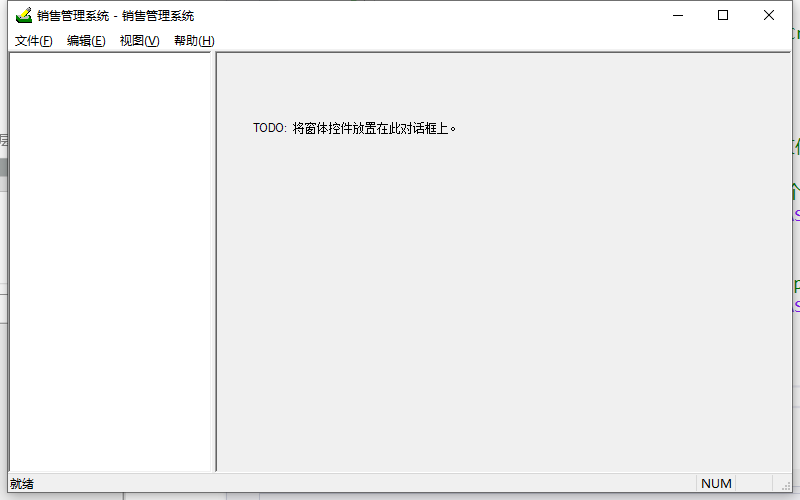
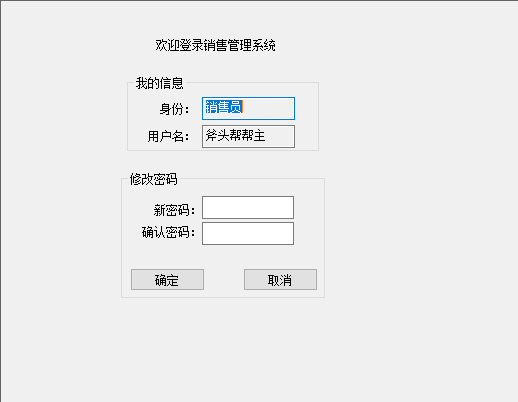
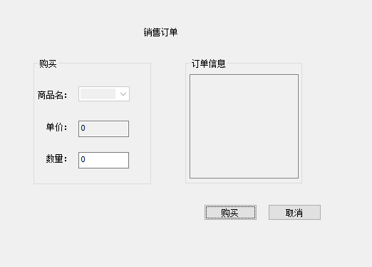
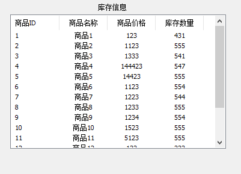
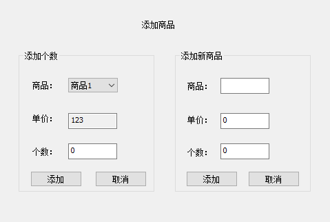
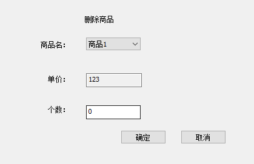
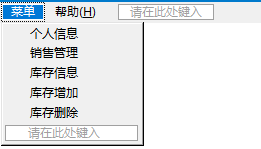

# 销售管理系统


# 登录对话框

- 为两个输入框分别设置变量`m_user`、`m_pwd`

- 初始化登录信息：在对话框类中**重写**`OnInitDialog`函数

```c++
m_user = TEXT("斧头帮帮主");
m_pwd = TEXT("123456");
UpdateData(FALSE);
```

- 添加登录按钮事件：验证用户名和密码
- 添加退出按钮事件：`exit(0);`
- 设置右上角关闭按钮功能：选中对话框模板 -> 右击【属性】 -> 【消息】 -> WM_CLOSE->`exit(0);`


# 布局：静态拆分窗口



在MFC中，子窗口是视图类，必须继承`xxxView`基类

- 1、添加MFC类：【类视图】->右键【类向导】->【添加类】的下拉框中选择【MFC类】
  - 左边的子窗口：类名`SelectView`，基类`CTreeView`
  - 右边的子窗口：类名`DisplayView`，基类`CFormView`

- 2、通过`CSplitterWnd`类拆分窗口：在主窗口类`CMainFrame`中声明类实例
- 3、重写框架类`CMainFrame`的`OnCreateClient`函数：规划两个子窗口的大小

```c++
BOOL CMainFrame::OnCreateClient(LPCREATESTRUCT lpcs, CCreateContext* pContext)
{
	// 静态拆分窗口，1行2列，CSplitterWnd::CreateStatic
	m_spliter.CreateStatic(this, 1, 2);
	// 创建视图：CSplitterWnd::CreateView
	//0, 0 ： 放在第0行第0列的位置
	//RUNTIME_CLASS(CSelectView) ：需要头文件#include "SelectView.h"， CSelectView在SelectView.h中声明
	// CSize(250, 500)：指定视图宽度和高度
	//pContext ： 为OnCreateClient()最后一个形参
	m_spliter.CreateView(0, 0, RUNTIME_CLASS(SelectView), CSize(200, 500), pContext);
    
	//0, 1： 放在第0行第1列的位置
	m_spliter.CreateView(0, 1, RUNTIME_CLASS(DisplayView), CSize(600, 500), pContext);
	return TRUE;
}
```


# 子窗口1：树视图

- 1、声明变量：由于子窗口1无法在资源视图中展示，因此只能在类中声明树控件的变量

```c++
CTreeCtrl *m_treeCtrl;	//树控件
CImageList m_imageList;	//图标列表
```

- 2、在`SelectView`的`OnInitUpdate`函数中进行**重写**，完成初始化功能：

```c++
void SelectView::OnInitialUpdate()
{
	CTreeView::OnInitialUpdate();
	// 创建图标集合
	m_imageList.Create(30, 30, ILC_COLOR32, 1, 1);
	// 加载图标
	HICON icon = AfxGetApp()->LoadIconW(IDI_ICON1);
	// 添加图标到集合中
	m_imageList.Add(icon);
	// 获取视图中的树控件
	m_treeCtrl = &GetTreeCtrl();
	// 设置树控件的图片列表
	m_treeCtrl->SetImageList(&m_imageList, TVSIL_NORMAL);
	// 设置节点
	HTREEITEM root1 = m_treeCtrl->InsertItem(TEXT("个人信息"), 0, 0, NULL);
	HTREEITEM root2 = m_treeCtrl->InsertItem(TEXT("销售管理"), 0, 0, NULL);
	HTREEITEM root3 = m_treeCtrl->InsertItem(TEXT("库存信息"), 0, 0, NULL);
	HTREEITEM root4 = m_treeCtrl->InsertItem(TEXT("库存添加"), 0, 0, NULL);
	HTREEITEM root5 = m_treeCtrl->InsertItem(TEXT("库存删除"), 0, 0, NULL);
}
```

- 3、添加树控件选项切换事件：【类视图】->重写【=TVN_SELCHANGED】

```c++
void SelectView::OnTvnSelchanged(NMHDR* pNMHDR, LRESULT* pResult)
{
	LPNMTREEVIEW pNMTreeView = reinterpret_cast<LPNMTREEVIEW>(pNMHDR);
	*pResult = 0;
	//获取当前选中节点
	HTREEITEM item = m_treeCtrl->GetSelectedItem();
	//获取节点的文本内容
	CString str = m_treeCtrl->GetItemText(item);
	if (str==TEXT("个人信息"))
	{

	}
	else if (str == TEXT("销售管理"))
	{

	}
	else if (str == TEXT("库存信息"))
	{

	}
	else if (str == TEXT("库存增加"))
	{

	}
	else if (str == TEXT("库存删除"))
	{

	}
}
```


# 子窗口2：展示视图

绘制多个Dialog，并将Dialog挂载到对应的树控件选项下

## 个人信息



- 插入Dialog，属性【Border】改为None，【Style】改为Child，工具箱绘制UI；添加类，基类选择`CFormView`
- 添加变量
- 初始化数据，在个人信息视图类`UserDlg`中**重写** `OnInitialUpdate` 函数

- 确认按钮事件：修改密码，更新文件
- 取消按钮事件：清空密码

## ==挂载界面==

左侧点击树控件选项，右侧展示界面，这个事件是在主窗口`CMainFrame`中实现的

- 1、在主窗口类`CMainFrame`的`.h`文件中声明自定义消息宏

```c++
#define NM_A	(WM_USER + 100)
#define NM_B	(WM_USER + 101)
#define NM_C	(WM_USER + 102)
#define NM_D	(WM_USER + 103)
#define NM_E	(WM_USER + 104)
```

- 2、将自定义消息放置在主窗口类`.cpp`文件的分界宏中

```c++
BEGIN_MESSAGE_MAP(CMainFrame, CFrameWnd)
	ON_WM_CREATE()
	//ON_MESSAGE响应的是自定义消息
	//产生NM_X消息，自动调用OnMyChange函数
	ON_MESSAGE(NM_A, OnMyChange)
	ON_MESSAGE(NM_B, OnMyChange)
	ON_MESSAGE(NM_C, OnMyChange)
	ON_MESSAGE(NM_D, OnMyChange)
	ON_MESSAGE(NM_E, OnMyChange)
END_MESSAGE_MAP()
```

- 3、在主窗口类`CMainFrame`中声明和定义消息处理函数`OnMyChange`

```c++
//.h自定义消息处理函数
afx_msg LRESULT OnMyChange(WPARAM wParam, LPARAM lParam);
//.cpp
LRESULT CMainFrame::OnMyChange(WPARAM wParam, LPARAM lParam)
{
}
```

- 4、点击树视图的选项，发送自定义消息给主窗口：在`SelectView`的`OnTvnSelchanged`函数中，发送自定义消息

```c++
//获取当前选项的文本内容，保存在str中

if (str==TEXT("个人信息"))
	{
	//需要包含框架类头文件#include "MainFrm.h" 
	//CWnd::PostMessage 将一个消息放入主窗口的消息队列
	//AfxGetMainWnd()：框架窗口对象的指针
	//AfxGetMainWnd()->GetSafeHwnd()：获取返回窗口的句柄，CWnd::GetSafeHwnd
	//NM_A：发送自定义消息
	//(WPARAM)NM_A：指定了附加的消息信息
	//(LPARAM)0：指定了附加的消息信息，此参数这里没有意义
		::PostMessage(AfxGetMainWnd()->GetSafeHwnd(), NM_A, (WPARAM)NM_A, (LPARAM)0);
	}
```

- 5、在主窗口类`CMainFrame`的`OnMyChange`函数中处理消息：根据获取的参数的不同，挂载不同的界面

```c++
LRESULT CMainFrame::OnMyChange(WPARAM wParam, LPARAM lParam)
{
	CCreateContext   Context;
	switch (wParam)
	{
	case NM_A:
	{
		//CUserDlg类需要包含头文件#include "UserDlg.h"
		Context.m_pNewViewClass = RUNTIME_CLASS(UserDlg);
		Context.m_pCurrentFrame = this;
		Context.m_pLastView = (CFormView*)m_spliter.GetPane(0, 1);
		m_spliter.DeleteView(0, 1);
		m_spliter.CreateView(0, 1, RUNTIME_CLASS(UserDlg), CSize(600, 500), &Context);
		UserDlg* pNewView = (UserDlg*)m_spliter.GetPane(0, 1);
		m_spliter.RecalcLayout();
		pNewView->OnInitialUpdate();
		m_spliter.SetActivePane(0, 1);
	}
	break;
	case NM_B:
            ...
		break;
	case NM_C:
            ...
		break;
	case NM_D:
            ...
		break;
	case NM_E:
            ...
		break;
	}
	return 0;
}
```


## 销售管理



- 绘制UI，挂载界面
- 添加变量
- 初始化数据，在销售管理视图类`SellDlg`中**重写** `OnInitialUpdate` 函数
  - 初始化combox，添加选项切换事件（【属性】->【控件事件】SELCHANGE），点击当前选项，获得对应单价和数量
- 购买按钮事件：显示订单信息、更新文件的库存数量
- 取消事件：重置


## 库存信息



- 绘制UI（列表控件，报表形式），挂载界面
- 添加变量
- 初始化数据：在库存信息视图类`InfoDlg`中**重写** `OnInitialUpdate` 函数
  - 从文件中读取库存信息并展示


## 库存添加



- 绘制UI（列表控件，报表形式），挂载界面
- 添加变量
- 初始化数据：在库存添加视图类`AddDlg`中**重写** `OnInitialUpdate` 函数
  - 初始化combox，添加选项切换事件（【属性】->【控件事件】SELCHANGE），点击当前选项，获得对应单价
- 添加按钮事件：更新库存文件
- 添加新商品按钮事件：调用API即可，注意添加成功后，需要更新下拉框选项

```c++
m_combo.ResetContent();	//清空下拉框
OnInitialUpdate();		//更新下拉框选项
```


## 库存删除



- 绘制UI，挂载界面
- 添加变量
- 初始化数据，在库存删除视图类`DelDlg`中**重写** `OnInitialUpdate` 函数
  - 初始化combox，添加选项切换事件（【属性】->【控件事件】SELCHANGE），点击当前选项，获得对应单价
- 确定按钮事件：更新库存文件
- 取消事件：重置


# 主窗口工具栏



- 【资源视图】->【Meun】->编辑UI
- 右键【添加事件处理程序】，选择COMMAND 消息类型，添加至`CMainFrame`框架类中
- 在事件处理函数中发送自定义信号，其它菜单操作类似：

```c++
//个人信息菜单
void CMainFrame::On32772()
{
	::PostMessage(AfxGetMainWnd()->GetSafeHwnd(), NM_A, (WPARAM)NM_A, (LPARAM)0);
}
```

